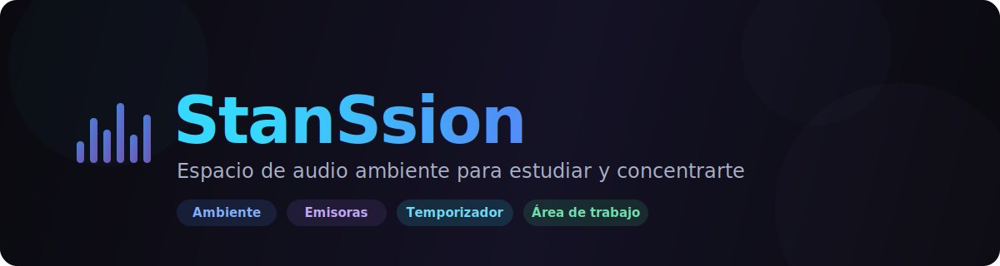

<div align="center">



<br/>

**Espacio de audio ambiente para estudiar, concentrarte y trabajar — sin perder el foco.**

[](https://react.dev)
[](https://vite.dev)
[](https://www.typescriptlang.org)
[](https://tailwindcss.com)
[](https://vercel.com)

[**🚀 Deploy en Vercel**](https://stan-ssion.vercel.app/) · [**🐛 Reportar algo**](https://github.com/JuanEstebanHerreraH/StanSsion/issues)

</div>

---

## ✨ Qué es

**StanSsion** es una app web para crear tu propio ambiente sonoro mientras estudiás o trabajás: mezclás sonidos ambientales, escuchás radios del mundo, subís tu propia música, controlás temporizadores tipo Pomodoro y tenés un lienzo libre para notas y tareas. Todo corre en el navegador, sin cuentas ni nube.

## 🎧 Funciones

| | |
|---|---|
| 🌧️ **Ambiente** | Sonidos como lluvia y bosque, con controles de **intensidad, velocidad y filtro**. Subí los tuyos: se guardan localmente. |
| 📻 **Emisoras** | Radio en vivo de todo el mundo vía *Radio Browser*. Buscá por **nombre, país o género**, marcá **favoritas**, armá **listas** y poné modo **aleatorio**. |
| 🎵 **Lista de reproducción** | Subí tus MP3/WAV/FLAC, creá **listas y favoritas**, buscador, reproductor con barra de progreso y *shuffle*. |
| ⏱️ **Temporizador** | Presets con **horas / minutos / segundos**, siempre visible en la barra superior, con **celebración** (sonido, confeti y notificación) al llegar a cero. |
| 🧠 **Área de trabajo** | Lienzo con *pan/zoom*, notas, tareas e imágenes, conexiones entre nodos y exportación. |
| 🎨 **Personalización** | Tema claro/oscuro/sistema, color de acento, fondo personalizado, visualizador con **colores RGB** y modo sin animaciones. |

## 🛠️ Stack

<div align="center">


</div>

- **UI:** React 18 + TypeScript, estilos inline con tokens y variables CSS para el theming.
- **Audio:** Web Audio API (samples reales, ganancia, *playbackRate* y filtro pasa-bajos).
- **Datos:** `localStorage` para preferencias y metadatos · `IndexedDB` para los audios.
- **APIs públicas (sin clave):** Radio Browser (emisoras) y GeoJS (país por IP).

## 🚀 Empezar

> Requisitos: **Node 18+** (recomendado 20).

```bash
# 1) Clonar
git clone https://github.com/JuanEstebanHerreraH/StanSsion.git
cd StanSsion

# 2) Instalar
npm install

# 3) Desarrollo (http://localhost:5173)
npm run dev

# 4) Build de producción
npm run build
```

No necesitás variables de entorno: la app no usa claves ni secretos. Si querés agregar alguna propia más adelante, copiá el ejemplo:

```bash
cp .env.example .env
```

## ☁️ Deploy en Vercel

La app es un sitio estático (SPA) — Vercel la detecta como **Vite** sin configuración extra.

| Ajuste | Valor |
|---|---|
| Framework Preset | **Vite** |
| Build Command | `npm run build` |
| Output Directory | `dist` |
| Install Command | `npm install` |

Importás el repo en Vercel → *Deploy*, o usás el botón de arriba. Listo.

## 📁 Estructura

```
StanSsion/
├─ docs/                       # banner del README
├─ index.html                  # punto de entrada
├─ src/
│  ├─ main.tsx                 # bootstrap de React
│  ├─ app/
│  │  ├─ App.tsx               # estado central + theming
│  │  └─ components/atmos/      # Dashboard, Radio, Playlist, Timer, Workspace, Settings…
│  ├─ assets/                  # loops de audio
│  └─ styles/                  # theme.css, tailwind, fonts
├─ .env.example
├─ .gitignore
├─ .nvmrc
└─ vite.config.ts
```

## 💾 Cómo se guardan tus datos

Todo es **local en tu navegador**: las preferencias y metadatos van a `localStorage`, y los audios que subís a `IndexedDB`. No se sube nada a ningún servidor. Para liberar espacio, usá **"Borrar todo"** en la lista de reproducción.

## ⚠️ Sobre las emisoras

Las radios vienen de *Radio Browser*, una base **comunitaria**: la cobertura varía por país, los resultados están acotados (~120) y ordenados por popularidad, y las emisoras `http` pueden estar bloqueadas por el navegador cuando la app corre en `https`. "Cerca de ti" detecta tu país por IP, así que una VPN puede cambiarlo.

## 📄 Licencia

MIT — usalo, modificalo y compartilo libremente.

<div align="center">
<br/>
<sub>Hecho con 💙 para concentrarse mejor.</sub>
</div>
